# Bartender Robot
[TOC]


## Overview of Bartender Robot
User goes to the webpage and speaks out his order, using `Start` and `Stop` button. The webpage correlates with [CPEE](https://cpee.org).
It has two components:
- Rule Engine: A Flask application that allows users to input regex rules with an associated end date.
- Discord Fetcher: Monitors orders channel of the discord server, processes orders, and matches them against existing rules based on the rule's regex pattern and end date.

After speaking out the order on the webpage, the user can access CPEE, where the following information is available:
1. The URL link of the audio
2. The transformed audio to text
3. The order details


------------------------------------------
## Software documentation
### Prerequisites software
- Everything is only tested in the Chrome browser
- Python 3.x 
  - speech_recognition (sound to text)
  - openai (text analysis)
- node (see [`package.json`](./package.json))
    - audit
    - axios
    - copy-webpack-plugin
    - dotenv
    - dotenv-webpack
    - express
    - mongodb (depricated)
    - multer
    - npm-run-all
    - raw-loader
    - webpack
    - webpack-cli
    - webpack-dev-server
- voice2json (sound to text)


### Installation procedure
Assuming that Python, node and voice2json are already installed on the server, following steps installs the server codes:

```bash
git clone https://github.com/Simin-Rad/bar-bot
pip install -r requirements.txt
npm install
npx webpack --config webpack.config.js
```

### Deployment on [`lehre.bpm.in.tum.de`](https://lehre.bpm.in.tum.de)
Configure parameters inside the `.env` including the following server ports, redirection paths and other variables (I provide an example of configurations that are currently used).

- set the ports
```bash
port=8000  # port for the web frontend server
port_put=8001 # port for file upload server
port_download=8002 # port for file download server
port_ai=8003 # port ai backend server responsible for sound to text conversion (voice2json and speech_recognition)
port_order_detection=8004 # port backend server responsible text analysis (openai)
```

- set the redirection paths (RBG firewall)
```bash
redirection_path="ports/8000"
redirection_path_put="ports/8001"
redirection_path_download="ports/8002"
redirection_path_ai="ports/8003"
redirection_path_order_detection="ports/8004"
```

- other variables
```bash
mongodb_uri="<mongodburi>" #depricated and not needed, but the code still checks whether it is set
db_name="Bartender" #depricated and not needed, but the code still checks whether it is set
root_path=home/students/ga46pul/p-course/bar-bot/server.js (at lehre.bpm.in.tum.de)
api_key=<OpenAI API Key> # this needs to be created on the OpenAI portal (see: https://platform.openai.com/docs/quickstart?context=python) 
```

### Run servers {#run-servers}
to run the servers, execute the following command.
```bash
npm run dev
```

This internally triggers all the forntend and backend servers see [`package.json`](./package.json). Currently, I am running this in a screen session on the `lehre` server.

## Implementation (what is where)
The codes can be structured in the following categories. I list the files in each category and provide a short description of what each file does. 

- Frontend
The frontend is implemented in javascript to provide a simple UI for the users. The core functionality of the forntend is to enable the user to record their order as a speech. the recorded sound is then passed to the backend servers for the analysis. After the backend analysis the transcribed order is rendered in the browser to the user.

```bash
.
├── public
│   ├── audio-recorder.js # audio recorder in browser functionality, leverages Web Audio API: AudioWorkletProcessor (see https://web.dev/articles/media-recording-audio)
│   ├── client.js # client side js functionalities 
│   ├── encode-audio.js # audio encoding functionality
│   └── index.html # html index
```

- Backend
The backend is also implemented in node js. The core idea here is to provide put/get functionalities for audio file insersion/retrieval from the server. Additionally, the backend provides speech recognition (AI-based) and text analysis (AI-based inference)

```bash
├── ai-server.js # server responsible for serving request for sound to text conversion (voice2json and speech_recognition)
├── download-server.js # server responsible for serving audio file get requests
├── put-server.js  # server responsible for serving audio file get requests
├── order-detection.js # server responsible for serving request for analyzing text using openai and encoding it into a predefined `order` object in json format.
├── server.js # main server responsible for serving the public static frontend files.
├── audio-handler.js # helper functionalities to handle storage of audio files on the server.
```

- Scripts
I am using various scripts to do the actual heavylifting for speech recognition and text inference in python.
```bash
├── ai_backend.py # python speech to text interface (speech_recognition)
├── module_openai.py  # python speech to text module (speech_recognition)
├── ai_order_detection.py # python text analysis interface (openai)
├── module_speech_recognition.py # python text analysis module (openai)
├── module_bot_mock.py # serves as a mock robot functionality, depricated
```

- Proejct files
project files for managing node dependencies, node run scripts and python scripts.
```bash
├── package.json # package file listing the node dependencies
├── webpack.config.js # bundling mechanism to customize the redirection paths in the frontend
├── requirements.txt # list of python dependency packages
```

- CPEE Engine model file
The Workflow engine model that is designed and implemented for this project (see [CPEE](https://cpee.org/)).
```bash
├──cpee_model.xml
```

- Documentation
Project documentation
```bash
└──  README.md # this file
```

## Overview of the workflow (CPEE model)
In CPEE, I've created a graph with four service calls with scripts. When the user speaks his order on the webpage, the first service call receives the audio. The services labeled 'Transform Audio to Text Py Speech Recognition' or 'Transform Audio to Text Voice2JSON' utilize the audio URL as input to convert the audio to text. Finally, as a bonus, the 'Order Detection' service uses this text as input to detect the order details. 
The graph consists of a loop, allowing users to place orders consecutively. Additionally, I've incorporated two decision points. The first decision offers the CPEE user two options for selecting the API to convert audio to text. The second decision involves detecting the order details. However, since I am using a paid service from OpenAI (for the API) token specifically for this functionality, I've implemented a bypassing path. If the token payment is not renewed, this step/feature can be skipped.

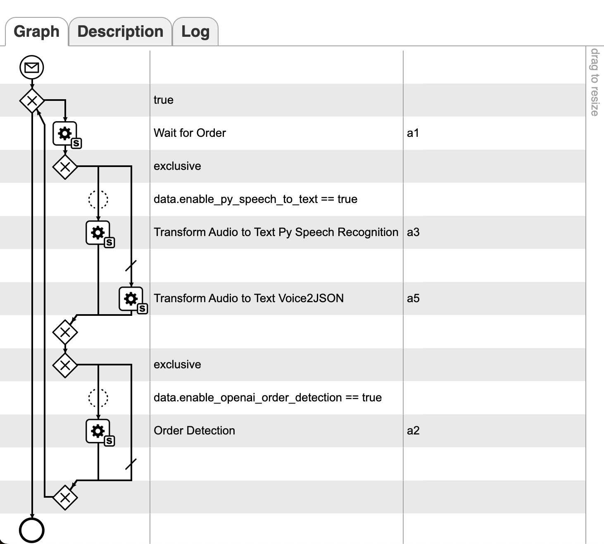


### Endpoints and their associated service calls (details of CPEE model implementation):

Following figure illustrates an overview of the endpoints used in the CPEE model implementation. Below, I will explain more details about each individual endpoints, their associated service calls and configurations. Note that, I am using asyncronous service calls for all the endpoints and therefore a callback is passed in the headers.

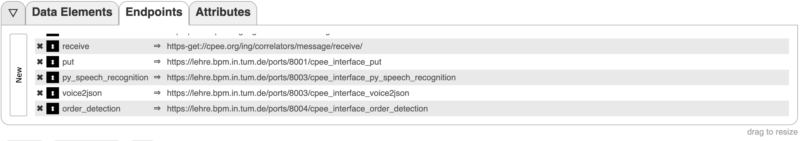


- **GET /cpee_interface_put (label put)**
  - Server: `put-server`
  - Port: `redirection_path_put`
  - Service call: `Transform Audio to Text Voice2JSON`
  - Arguments: -
  - Headers: `CPEE-CALLBACK`, a CPEE callback URL is passed which is triggered once the user finishes recording the order (audio).
  - Respone and output handling: `audio_order` which includes the `url` of the audio file served by the server.

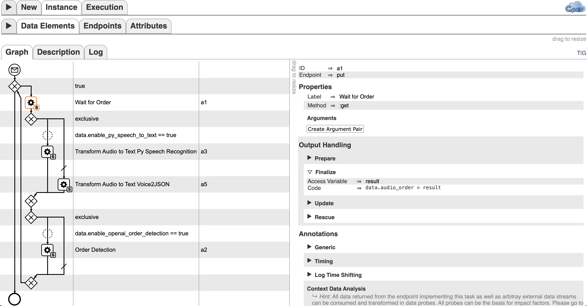

- **GET /cpee_interface_py_speech_recognition**
  - Server: `ai-server`
  - Port: `redirection_path_ai`
  - Service call: `Transform Audio to Text Py Speech Recognition`
  - Arguments: `order_url`, i.e., the url of the audio file which is used by the backend to download the audio file for processing.
  - Headers: `CPEE-CALLBACK`, a CPEE callback URL is passed which is after speech recognition step is performed in the backend.
  - Respone and output handling: `ordertext` which is a json object including the raw text returned from the backend after speech recognition

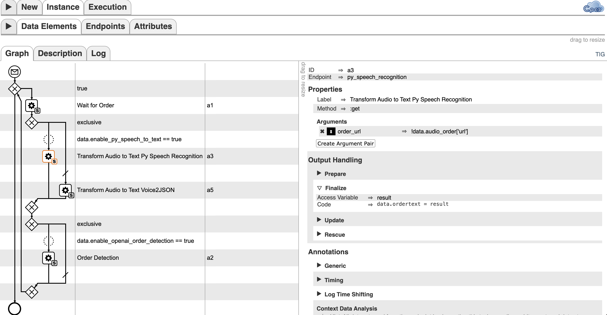

- **GET /cpee_interface_voice2json**
  - Server: `ai-server`
  - Port: `redirection_path_ai`
  - Service call: `Wait for Order`
  - Arguments: `order_url`, i.e., the url of the audio file which is used by the backend to download the audio file for processing.
  - Headers: `CPEE-CALLBACK`, a CPEE callback URL is passed which is after speech recognition step is performed in the backend.
  - Respone and output handling: `ordertext` which is a json object including the raw text returned from the backend after speech recognition

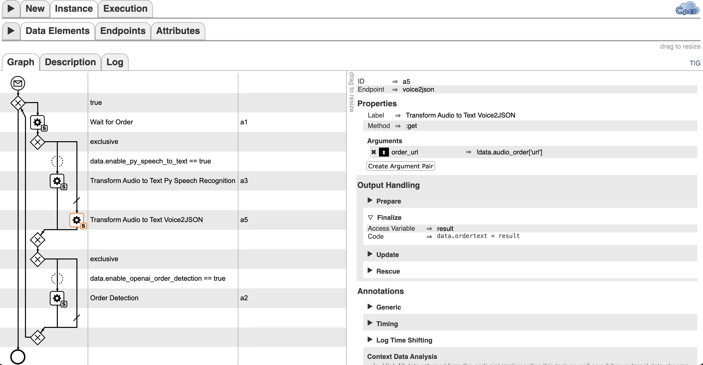

- **GET /cpee_interface_order_detection**
  - Server: `order-detection`
  - Port: `redirection_path_order_detection`
  - Service call: `Order Detection`
  - Arguments: `ordertext`, i.e., the raw text passed to the backend to detect the order
  - Headers: `CPEE-CALLBACK`, a CPEE callback URL is passed which is after speech recognition step is performed in the backend.
  - Respone and output handling: the detected `order` will be placed in `Data Elements` in the form of `{"name":"drink name", "size":"size", "number":"number of drinks"}`.

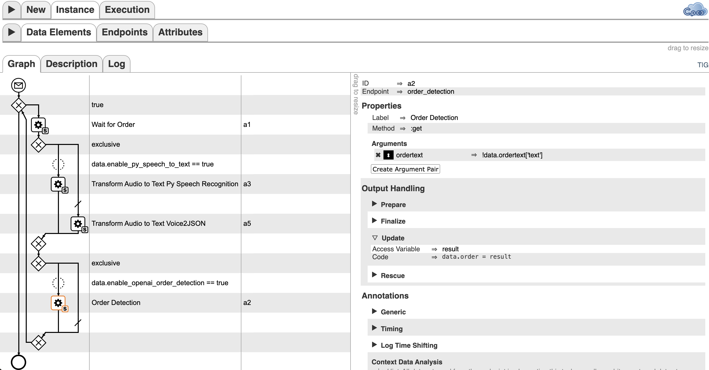


### Data Elements

- **enable_py_speech_to_text**: When this element is set to 'true,' Voice2Json will handle the transformation of audio to text.
- **enable_openai_order_detection**: When this element is set to 'true', the OpenAI API will detect the order details from the ordertext. 
- **audio_order**: Here, the filename and the URL to the audio are displayed.
- **ordertext**: Here, the transformed audio to text is presented.
- **order**: When "enable_openai_order_detection" is set to true, this will subsequently print out the name of the order, its size, and the amount.

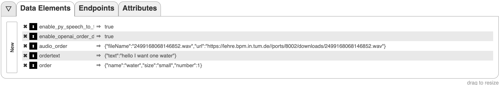

## How to use bar-bot (example scenario):

**1. Run the Server**:
    - First start the servers (see [run servers](#run-servers)).

**2. Navigate to the CPEE using the following url**: https://cpee.org/flow/?monitor=https://cpee.org/flow/engine/37073/


**3. Navigate to the Data Elements**:
    - Set the data element "enable_py_speech_to_text" switch to `true` if you want to use Python speech_recognition module for audio-to-text conversion. If set to `false`, Voice2Json will handle the transformation.
    - Set the data element "enable_openai_order_detection" switch to `true` to enable order detail detection; set to `false` otherwise.
    - Proceed to the execution phase (execution tab) and initiate CPEE.


**4. Access Webpage (user interface)**:

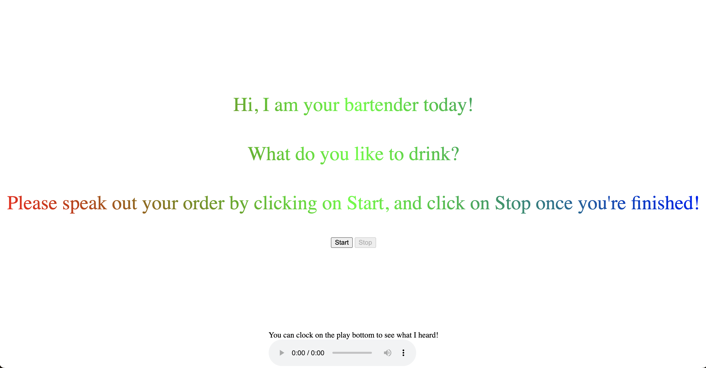
    - Click the `Start` button, speak out your order in English, then click the `Stop` button.
    - You can listen to your order by clicking the `play` button on the webpage.

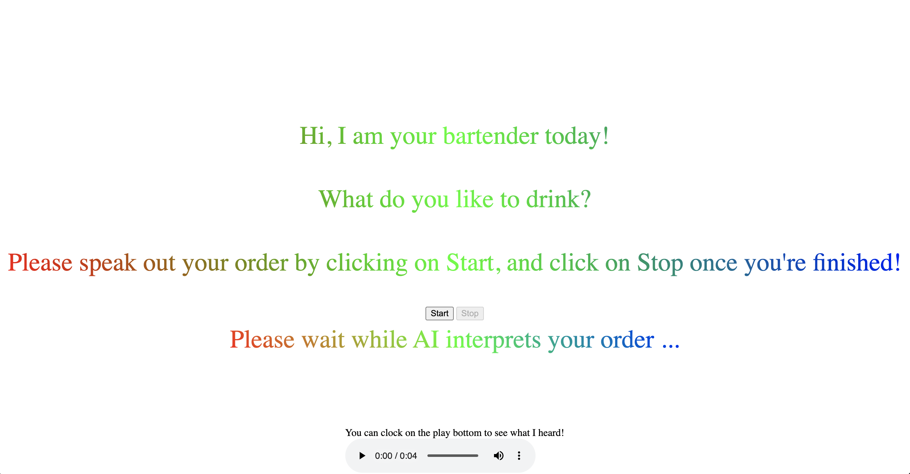
    - Upon successful detection of your `order` (i.e., speech to text results in correct text and order  detection results in correct order), it will be displayed. Otherwise, the message `Sorry, I did not catch your order, please repeat again!` will be shown.

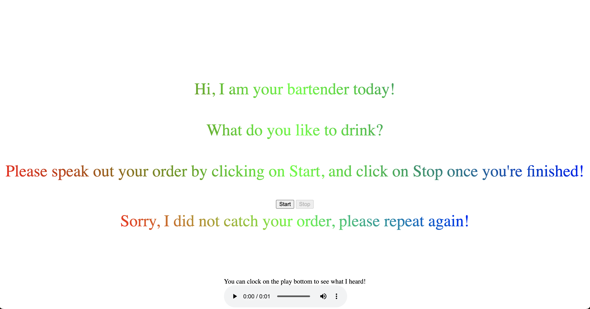

**5. Order recognition**:
    - In CPEE, navigate to `Data Elements` and locate `data_order`. This data element includes a URL for accessing the recorded audio file served by the backend. You can access the audio file by copying the URL and opening it in your browser to play.
    - The converted audio to text is also accessible in `ordertext`.
    - If you have set the data element "enable_openai_order_detection" to `true`, then the detected `order` will be placed in `Data Elements` in the form of `{"name":"drink name", "size":"size", "number":"number of drinks"}`.

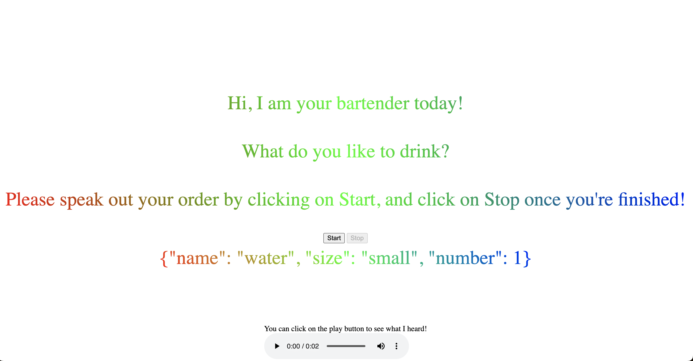

